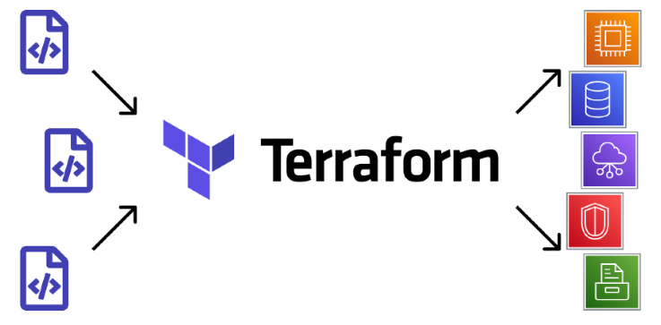

# Estudo Terraform e AWS

## Descrição
Este repositório demonstra o uso do Terraform com a AWS, abordando desde estruturas básicas até configurações mais complexas.

## Pré-Requisitos
Certifique-se de ter as seguintes ferramentas instaladas e configuradas em sua máquina:

#### - Terraform (Versão 1.9.8)
#### - AWS CLI configurado com suas redenciais
#### - Python

## Configuração do Ambiente
Para configurar o ambiente e implantar os recursos, siga os passos abaixo:

### Configurar o AWS CLI:
bra o PowerShell ou terminal e execute o comando abaixo para configurar as credenciais de acesso da AWS com o Access Key ID e Secret Access Key do seu perfil:
```Shell
aws configure
```

### Configurar o Terraform:

Inicialize o Terraform para baixar os plugins necessários, garantindo que todos os recursos possam ser provisionados corretamente:

```terraform
terraform init
```

## Criar o plano de execução:

Crie um plano de execução para visualizar as alterações que serão aplicadas na infraestrutura:

```terraform
terraform plan
```
## Aplicar as mudanças:

Aplique o plano para realizar a implantação dos recursos na AWS:

```terraform
terraform apply
```

](image.png)